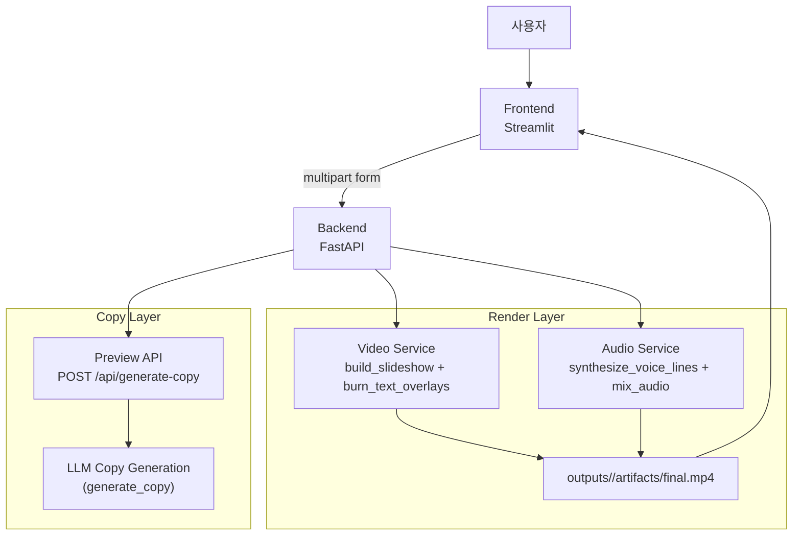

# 🎬 AI 유튜브 숏폼 광고영상 제작 프로그램 (MVP)
---

소상공인(특히 오프라인 외식업)이 온라인 홍보로 전환할 때 필요한 광고 콘텐츠 제작 부담을 줄이기 위한 프로젝트입니다. 사용자가 매장/메뉴 사진을 업로드하면, LLM이 쇼츠 스타일 카피를 만들고 FFmpeg 파이프라인이 9:16 광고 영상을 자동으로 생성합니다.

- ✅ 입력: 음식/매장 사진 1장 이상(실사용 권장 10~15장)
- ✅ 출력: 9:16 MP4 (기본 18초)
- ✅ 자막: LLM 캡션 생성 + drawtext burn-in
- ✅ 오디오: TTS + BGM 조합(무음/BGM/TTS/BGM+TTS)
- ✅ 편집: 생성된 자막/나레이션 문구를 미리 확인하고 수정 후 최종 렌더링

---

## 🧩 시스템 아키텍처


### 구성요소 책임 분리

- **Frontend (Streamlit)**
  - 이미지 업로드, 순서 정렬, 오디오 옵션 선택
  - 자막/나레이션 초안 생성 요청 및 사용자 수정
  - 최종 생성 요청 후 결과 영상 재생
- **Backend (FastAPI)**
  - 입력 검증, job 디렉토리 관리, API 응답 모델 관리
  - LLM/TTS/FFmpeg 서비스 오케스트레이션
- **Services**
  - `llm.py`: 캡션/프로모션/해시태그 생성 및 fallback
  - `video.py`: 슬라이드쇼, 자막 burn-in, 오디오 믹스
  - `tts.py`: OpenAI/macOS/gTTS 기반 음성 생성 + 후처리
  - `storage.py`: `outputs/<job_id>` 구조 생성
- **배포**
  - `frontend/Dockerfile`: Frontend 컨테이너 구성
  - `backend/Dockerfile`: Backend 컨테이너 구성
  - `docker-compose.yml`: Docker Compose 구성
- **Model**
  - `llm.py`: `gpt-4o-mini`를 사용한 자막/프로모션/해시태그 생성 및 fallback
  - `tts.py`: `tts-1`, `macOS`, `gTTS`를 사용한 TTS API 호출

---

## 1) 왜 FFmpeg 중심인가?
- 성능/호환성/재현성 측면에서 Python 영상 라이브러리보다 운영 안정성이 높습니다.
- 이미지 비율이 제각각이어도 `scale + pad + setsar`로 concat 입력을 표준화할 수 있습니다.

## 2) 왜 drawtext인가?
- libass는 환경/폰트 의존성이 높아 깨질 수 있어, MVP에서는 drawtext를 기본으로 선택했습니다.
- 폰트 파일 경로를 명시해서 컨테이너/로컬 실행 차이를 줄였습니다.

## 3) 캡션 타이밍 전략
- 현재 기본은 “줄 수 기준 균등 분배”이며, TTS 타이밍이 있으면 해당 타이밍을 사용합니다.
- 운영 관점에서는 “이미지 컷 전환과 자막 전환 동기화”가 가장 사용성/안정성 균형이 좋습니다.

## 4) API 경계
- `/api/generate-copy`: 자막/나레이션 초안 미리 생성
- `/api/generate-flex`: 사용자 확정 문구(`caption_text`) 포함 최종 렌더링
- `/api/generate-basic`, `/api/generate`: 레거시/기본 흐름

---

## 🔌 API 요약

## POST `/api/generate-copy`
목적: 영상 생성 전에 문구 초안 확인/수정

주요 입력(Form):
- `menu_name`(필수), `store_name`, `tone`, `price`, `location`, `benefit`, `cta`

주요 출력:
- `caption_text`: 줄바꿈 포함 전체 문구
- `caption_lines`: 줄 배열
- `hashtags`: 추천 해시태그

## POST `/api/generate-flex`
목적: 오디오 옵션 + 사용자 수정 문구 반영 최종 영상 생성

주요 입력(Multipart):
- `images`(필수, 다중)
- `caption_text`(선택, 사용자가 수정한 최종 문구)
- `use_tts`, `use_bgm` (bool)
- `bgm_file` (선택)
- 기타 비즈니스 필드 (`menu_name`, `tone`, ...)

주요 출력:
- `job_id`
- `video_url` (`/outputs/<job_id>/artifacts/final.mp4`)
- `caption_text`, `hashtags`

---

## 📁 디렉토리 구조

```text
backend/
  app/
    api/
      routes.py
      routes_basic.py
      routes_flex.py
    services/
      llm.py
      tts.py
      video.py
      storage.py
    core/
      config.py
      logger.py
frontend/
  app.py
  pages/
    1_basic.py
    2_voice.py
    3_오디오 옵션.py
assets/
  bgm/
  fonts/
outputs/            # 런타임 생성 산출물
docker-compose.yml
```

---

## 🐳 실행 방법 (Docker 권장)

### 1) 준비
- Docker Desktop 설치/실행

### 2) `.env` 생성
```bash
cp .env.example .env
```
예시:
```ini
OPENAI_API_KEY=sk-...
OPENAI_MODEL=gpt-4o-mini
```

### 3) 실행

```bash
docker-compose up -d --build
```

### 4) 접속 
| 서비스 | 주소 | 설명 |
|---|---|---|
| Frontend | http://localhost:18501 | Streamlit UI |
| Backend Docs | http://localhost:18000/docs | FastAPI Swagger |

---

## 🛠️ 로컬 개발 실행 (참고)

> 운영/재현성 기준으로 Docker 사용을 권장합니다.

Docker-compose up -d --build

Docker가 없으면 아래를 참고하세요.

1. FFmpeg 설치
2. 가상환경 생성
```bash
python -m venv .venv
source .venv/bin/activate  # Windows: .venv\Scripts\activate
```
3. 의존성 설치
```bash
pip install -r backend/requirements.txt
pip install -r frontend/requirements.txt
```
4. 실행
```bash
uvicorn backend.app.main:app --reload --port 8000
streamlit run frontend/app.py --server.port 8501
```

---

## 🎥 렌더링 파이프라인(코드 레벨)

1. **build_slideshow**
   - 이미지들을 9:16으로 정규화 후 zoompan 모션 적용
2. **burn_text_overlays**
   - drawtext로 자막 burn-in (스타일/타이밍 적용)
3. **synthesize_voice_lines (선택)**
   - 줄 단위 TTS 생성 + 후처리 + 타이밍 계산
4. **mix_audio (선택)**
   - voice/bgm 조합 후 최종 mux

---

## ⚙️ 현재 알려진 기술 부채 (엔지니어 체크리스트)

- `routes.py`, `routes_basic.py`, `routes_flex.py`에 공통 로직이 많아 리팩토링 여지 큼
- 영상 길이/컷 길이 사용자 제어가 제한적(고정값 중심)
- 테스트 코드 부재(유틸/라우트/서비스 단위 테스트 필요)
- 오디오 믹싱 주석과 실제 동작 정합성 점검 필요

---

## 🚀 다음 단계 제안 (고도화 순서)

1. 컷 단위 편집 기능
   - 이미지별 duration 입력
   - 컷 전환 시 자막 전환(구분자 기반 편집)
2. 품질 안정화
   - 테스트 추가(pytest + API contract)
   - 공통 로직 서비스 레이어로 분리
3. 생성형 확장
   - 이미지 보강 컷 생성
   - BGM 추천/생성 파이프라인 연동
4. 광고 성능 최적화
   - 스토리보드 기반 A/B 2~3버전 자동 생성
   - 훅/CTA 품질 스코어링 후 재생성

---

## ⚠️ 트러블슈팅 메모

1) zoompan 에러 (`Undefined constant / missing '('`)
- 원인: filter 문자열 조합 오류
- 대응: `zoompan=...:d=...:s=...:fps=...` 형태를 엄격히 유지

2) WEBP Exif 경고 (`invalid TIFF header`)
- 원인: 일부 WEBP 메타데이터 손상
- 대응: JPG/PNG 변환 또는 Pillow 리세이브 전처리

3) TTS fallback 품질 편차
- 원인: OpenAI/macOS/gTTS 실행 경로별 차이
- 대응: 환경별 우선순위/로그 점검, backend 컨테이너에 키 주입 확인

✅ [데모 결과물 클릭](https://vimeo.com/1159512235?share=copy&fl=sv&fe=ci)


